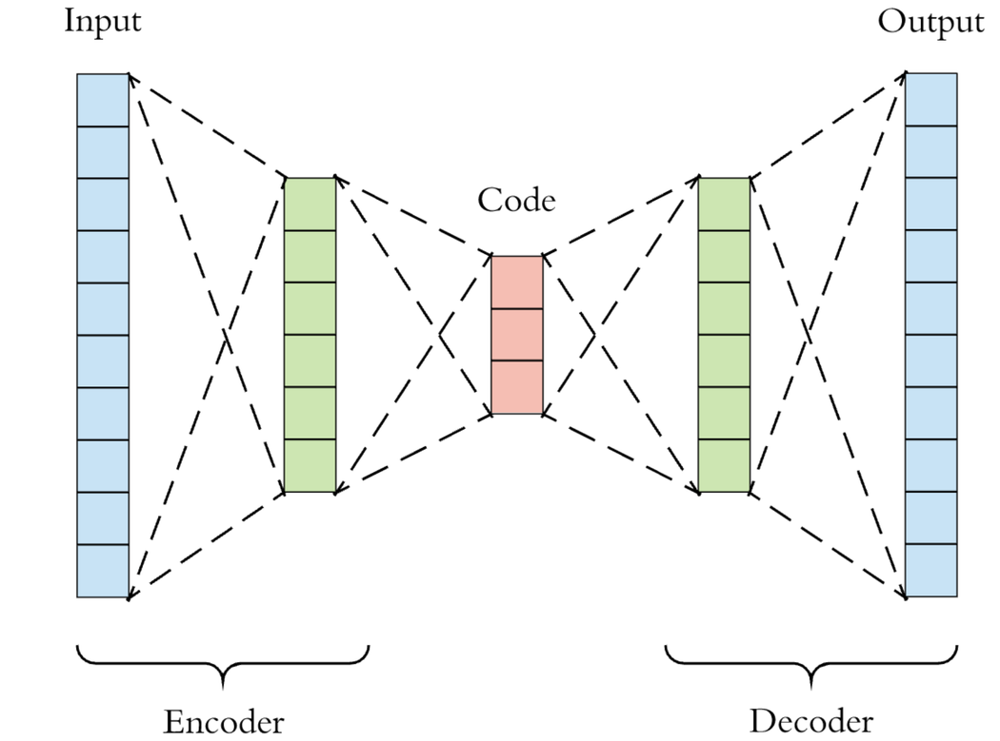
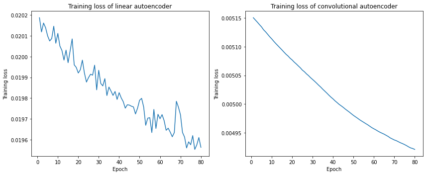
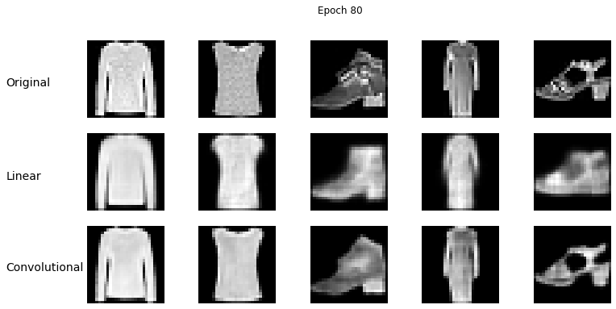

# Linear vs. Convolutional Autoencoders

An autoencoder is a neural network that can be used to encode and decode data. The general structure of an autoencoder consists of two parts: an encoder and a decoder. The encoder compresses the input data into a lower dimensional representation (“code” in the schematic below, which is often referred to as the latent space representation) by extracting the most salient features of the data, while the decoder reconstructs the input data from the compressed representation. Therefore, autoencoder is often used for *dimensionality reduction*.

    

In this notebook (`autoencoders.ipynb`) we constructed two types of classical autoencoders in [PyTorch](https://pytorch.org/) to reconstruct the `Fashion-MNIST` images: the linear and convolutional autoencoders. It is based on [this tutorial](https://covalent.readthedocs.io/en/latest/tutorials/machine_learning/autoencoders.html#) I wrote for Covalent at the beginning of my internship at [Agnostiq](https://agnostiq.ai/) in June 2022.

In the case of a linear autoencoder, we use four hidden layers in the encoder. Between each layer the `ReLU` activation function is applied. The decoder is essentially the “inverse” of the encoder, and we use the same architecture for it except at the end an additional `Sigmoid` activation function is applied. The choice of this activation function depends on the range of the pixel intensity in the original input data. Note that the `Fashion-MNIST` dataset contains 28x28-pixel gray-scale images, so the input dimension of each image is 28x28x1. The compressed images generated by the encoder in this case then have dimension 3x3x1. 

For the convolutional autoencoder, we use three hidden layers. Each convolutional layer except for the last one in the encoder uses the `Conv2d` construction with a kernel size of 3x3, a stride of 1, and a padding of 1, followed by a `ReLU` activation function. The decoder uses the `ConvTranspose2d` layers to reverse the action of the `Conv2d` layers in the encoder, followed by a `Sigmoid` activation function.

Here is what the training losses look like for both autoencoders:

Clearly, the losses for the convolution autoencoder are much lower than the linear counterpart. This is also reflected in the quality of the reconstructions. Here I show 5 examples at the end of the training.

P.S. Since I just purchased the M2 MacBook Air base model (in July 2022) and PyTorch has recently announced [support for GPU-accelerated PyTorch training on Macs with Apple Silicon](https://pytorch.org/blog/introducing-accelerated-pytorch-training-on-mac/), I decided to train the models on both the CPU and the GPU and see if there is any noticeable difference in the performance. Unfortunately, for the test I ran, the GPU run took about the same amount of time as the CPU run (meh...). This is probably due to the fact that the GPU in my MacBook Air has only 8 cores.