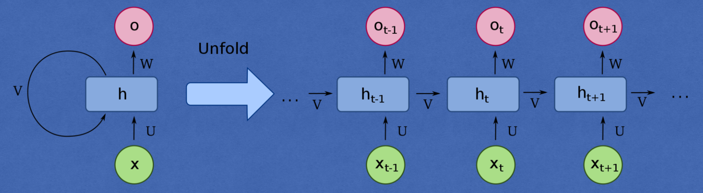

# Classifying names with a character-level recurrent neural network (RNN)

This one is based on the PyTorch tutorial: [NLP From Scratch: Classifying Names with a Character-Level RNN](https://pytorch.org/tutorials/intermediate/char_rnn_classification_tutorial.html). I also borrowed from [this repo](https://github.com/python-engineer/pytorch-examples/tree/master/rnn-name-classification).

Recurrent neural networks (RNNs) are a class of neural networks that allow previous outputs to be used as inputs while having hidden states (see schematic below). RNNs are also called recurrent neural networks because they are designed to process sequences of data.

    

In this demonstration, we will train a character-level RNN on surnames from 18 languages of origin, and predict which language a name is from based on the spelling. The RNN processes all the letters in a given name in sequence, which correspond to the inputs $\{x_1, \dots, x_t, \dots\}$ in the schematic above. At each step, the network processes information of the previous step produced by a hidden layer, together with the input at the current step. The structure of the particular RNN we will use is shown below:

    

See the network construction in [`rnn_name_classificaiton`](rnn_name_classifier.ipynb) for more details. Finally, the RNN outputs a probability distribution over the 18 languages. To turn each letter into a PyTorch tensor, we use the "one-hot vector" trick: A one-hot vector is filled with 0s except for a 1 at index of the current letter, e.g. `"b" = <0 1 0 0 ...>`.