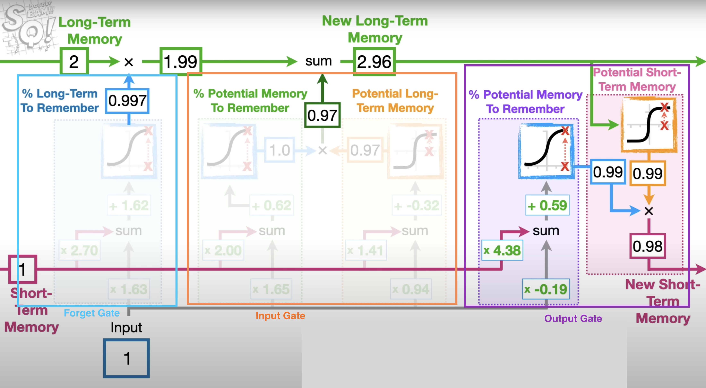
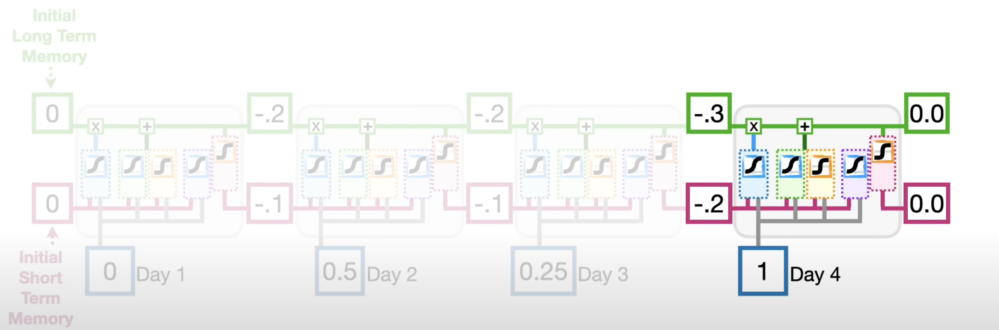

Long short-term memory (LSTM) network is a recurrent neural network (RNN), aimed to deal with the vanishing gradient problem present in vanilla RNNs. Its relative insensitivity to gap length is its advantage over other RNNs, Hidden Markov Models, and other sequence learning methods. 

# LSTM Architecture
## LSTM Cell Structure
A LSTM cell is consists of a cell state, an input gate, a forget gate, an output gate, and a hidden state. The cell state is the memory of the LSTM cell. The input gate controls the amount of new information to be added to the cell state. The forget gate controls the amount of information to be removed from the cell state. The output gate controls the amount of information to be outputted from the cell state. The hidden state is the output of the LSTM cell.

source: [Long Short-Term Membory (LSTM), Clearly Explained - StatQuest](https://www.youtube.com/watch?v=YCzL96nL7j0)

## LSTM Layer Structure
A LSTM layer is consists of multiple LSTM cells. The hidden state of the previous LSTM cell is the input of the next LSTM cell. The cell state of the previous LSTM cell is the input of the next LSTM cell. The cell state of the last LSTM cell is the output of the LSTM layer. The hidden state of the last LSTM cell is the output of the LSTM layer.

source: [Long Short-Term Membory (LSTM), Clearly Explained - StatQuest](https://www.youtube.com/watch?v=YCzL96nL7j0)

## Stcked LSTM Layer Structure
A stacked LSTM layer is consists of multiple LSTM layers. The hidden state of the previous LSTM layer is the input of the next LSTM layer. The cell state of the previous LSTM layer is the input of the next LSTM layer. The cell state of the last LSTM layer is the output of the stacked LSTM layer. The hidden state of the last LSTM layer is the output of the stacked LSTM layer.

# Implement LSTM in PyTorch to Predict Stock Price
LSTM cell is a single LSTM unit. LSTM layer is a collection of LSTM cells. In PyTorch, LSTM cell is implemented as [nn.LSTMCell](https://pytorch.org/docs/stable/generated/torch.nn.LSTMCell.html#torch.nn.LSTMCell). LSTM layer is implemented as [nn.LSTM](https://pytorch.org/docs/stable/generated/torch.nn.LSTM.html#torch.nn.LSTM). I was confused about the difference between these two modules in PyTorch. I read through some discussions and summarized the distinctions as follows:
1. LSTMCell takes ONE input x_t. You need to loop through the sequence and feed one input at a time. LSTM takes a sequence of inputs x_1, x_2, ..., x_T. You can feed the whole sequence at once. [This post](https://github.com/CarlosJose126/RNNs/blob/main/LSTMCellvsLSTM.ipynb) presents the implementation of both approaches.
2. LSTM may be faster than LSTMCell when running on GPU because LSTM is cuDNN optimized.

In this project, we are going to apply LSTM on the historical stock close data to predict the future stock price of Amazon. We start with the data preparation, then build the LSTM model, and finally train the model and make predictions. Detailed code and explanations are provided in the Jupyter Notebook [Amazon Stock Forecasting with LSTM.ipynb](<Amazon Stock Forecasting with LSTM.ipynb>).